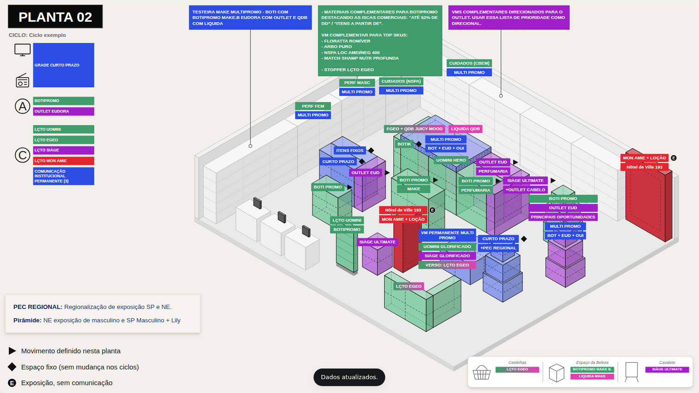

# Plano de Varejo · Visualizador de Plantas

App em **Google Apps Script** que desenha as plantas da loja em 3D isométrico, no formato de slide (16:9), com cada móvel pintado pela cor da marca. Tudo vem de uma planilha: é só trocar o **ciclo** no seletor que as cores e os textos mudam.



| Cor | Marca | Código na planilha |
|---|---|---|
| verde | Boticário | `BOT` |
| rosa | Quem disse, berenice? | `QDB` |
| roxo | Eudora | `EUD` |
| vermelho | O.U.i | `OUI` |
| azul | Multimarca | `MULTI` |
| branco | Sem marca / sem movimento | `NEUTRO` (ou vazio) |

## O que ele faz

- **Abre com a planta limpa** (sem cores, etiquetas nem caixas de destaque) até você escolher um ciclo no seletor; a opção *Sem ciclo (planta limpa)* volta a esse estado.
- **Seletor de ciclo e abas por planta** (ER P, ER M, ER G e ER GG = plantas 01 a 04). As setas ← → do teclado trocam de planta.
- **Móveis coloridos pela marca**, com as etiquetas (caixas de texto) de cada móvel, os símbolos ▶ ◆ Ⓔ e NEW, as caixas de destaque que apontam para um móvel, a lateral TV/rádio, (A), (C), as notas e a faixa Cestinhas / Espaço da Beleza / Cavalete.
- **Botão "Baixar planilha base"**: gera um `.xlsx` com uma linha por móvel de cada planta, listas suspensas e cores por marca. Pode vir em branco ou já preenchido com um ciclo existente, para servir de ponto de partida do próximo.
- **Botão "Importar planilha"**: lê o `.xlsx` preenchido, grava no Google Sheets e já mostra o ciclo importado.
- **Zoom na planta**: role o mouse sobre a planta (ou use a pinça no celular, os botões − / + acima dela ou as teclas <kbd>+</kbd> <kbd>−</kbd> <kbd>0</kbd>). Com zoom, arraste para mover a planta. As etiquetas crescem junto com a planta, para ler melhor; as caixas de destaque continuam do mesmo tamanho na tela. Clique no percentual para voltar a 100%. O PNG sai sempre sem zoom.
- **Estratégia do móvel**: clique num móvel (ou numa etiqueta dele) para abrir uma tela inteira com o desenho do móvel e o que o ciclo define para ele: marca, símbolo, etiquetas (com a cor e o bloco de cada uma), observação e, na gôndola, mesas, totem e móvel make, a linha de cada espaço.
- **Filtro por marca**: clique numa marca da legenda para destacar só ela; os móveis e etiquetas das outras marcas ficam em tons de cinza (etiquetas em cinza mais escuro, móveis em cinza mais claro).
- **Baixar PNG**: o *slide completo* em 3840×2160, pronto para colar na apresentação, ou *só a planta com as etiquetas* (sem os painéis e com fundo transparente, recortada no desenho). Com uma marca no filtro, o PNG sai igual à tela: só ela colorida.
- **Etiquetas sem sobreposição**: as etiquetas se afastam sozinhas para nenhuma ficar em cima de outra (nem das caixas de destaque e notas); se não houver lugar perto do móvel, vão para o espaço livre mais próximo, com linha-guia. Para outra posição, use *Ajustar etiquetas*, arraste e clique em *Salvar posições* (as de uma gôndola movem juntas). Os móveis aparecem em cores foscas e opacas; as etiquetas mantêm as cores das marcas.

## Construir loja (editor do layout)

Clique em **Construir loja** para abrir o editor ao lado da planta. A planta **abre com o modelo atual** (os móveis salvos dela), pronta para editar; trocar de planta no editor também abre o modelo daquela planta. Fechar sem salvar não apaga nada; ao clicar em **Salvar planta**, o layout passa a ser o que está na tela.

| Para… | Faça |
|---|---|
| Adicionar um móvel | Clique no móvel na paleta (Gôndola, Pirâmide, Móvel de fila, Móvel de parede, Totem, PDV móvel, Mesa destaque, Mesa destaque 3 frentes, Balcão recepção, Móvel de atendimento, Parede O.U.i, Totem O.U.i, Ilha premium O.U.i, Móvel make). Ele aparece no centro da loja, já selecionado, com ID automático: o nome do móvel e o próximo número livre (`GONDOLA 3`, `MOVEL DE FILA 2`…). |
| Selecionar | Clique no móvel: ele fica com contorno laranja. Clique no piso vazio ou aperte <kbd>Esc</kbd> para desmarcar. |
| Mover | Arraste o móvel (segure <kbd>Alt</kbd> para mover fino) ou use as setas (→ +X, ↓ +Y; <kbd>Shift</kbd> = 5×). No celular/tablet, arrastar um móvel não rola a página; para rolar, deslize no piso vazio ou fora da planta. |
| Girar / duplicar / excluir | Use a barra preta que aparece sobre o móvel, ou <kbd>R</kbd>, <kbd>Ctrl</kbd>+<kbd>D</kbd> e <kbd>Delete</kbd>. Girar troca largura e fundo; no balcão recepção, muda o canto do L (4 posições). |
| Mudar nome, tipo, tamanho | Edite no painel, em **Móvel selecionado**. ID e elevação ficam em *Mais opções*. |
| Voltar atrás | **Desfazer** ou <kbd>Ctrl</kbd>+<kbd>Z</kbd>. Desfaz uma ação por vez, inclusive exclusões. |
| Guardar | **Salvar planta** (aba Layout no Apps Script; navegador na versão web). O rodapé mostra se há alterações não salvas. |

### Os móveis

| Móvel | Como é desenhado | Na planilha |
|---|---|---|
| **Gôndola** (`GONDOLA 1`…) | 4 espaços: **Lado A**, **Meio A**, **Meio B** e **Lado B**, com 4 níveis de prateleira. "A" é sempre o que está virado para quem olha a planta (o lado A é a ponta da frente; o meio A, a face da frente). Cada meio pode ser dividido em dois (*Dividir o meio A/B em dois*). | Uma linha para a gôndola inteira (`GONDOLA 1`) e uma por espaço: `GONDOLA 1/LADO-A`, `GONDOLA 1/MEIO-A` (ou `MEIO-A-1` e `MEIO-A-2` quando dividido), `GONDOLA 1/MEIO-B`, `GONDOLA 1/LADO-B`. O espaço preenchido tem cor e etiqueta próprias; o espaço vazio usa a linha da gôndola inteira. Para deixar um espaço branco, use `NEUTRO`. **Etiquetas por bloco:** na linha da gôndola inteira, Etiqueta 1 = Lado A, 2 = Meio A, 3 = Meio B e 4 = Lado B; a linha de um espaço mostra **até 4 etiquetas** (Etiqueta 1 a 4) empilhadas em cima daquele bloco e substitui a que viria da gôndola inteira. **Dividir um meio pela planilha:** preencha também a linha da metade 2 (`GONDOLA 1/MEIO-A-2`); a linha do meio passa a valer para a metade 1 e a planta mostra o meio dividido, com um vão entre as metades. (Os nomes antigos `PONTA-2` e `PONTA-1` continuam aceitos como Lado A e Lado B.) |
| **Pirâmide** (`PIRAMIDE 1`…) | 4 blocos iguais, um em cima do outro (divisões tracejadas) (padrão 1,02 × 1,02 × 1,94). | Uma linha, **até 4 etiquetas** (empilhadas). |
| **Móvel de fila** (`MOVEL DE FILA 1`…) | Bloco único retangular com 3 níveis (padrão 1,5 × 0,4 × 1,46). | Uma linha. |
| **Móvel de parede** (`MOVEL DE PAREDE 1`…) | Estante encostada na parede, com prateleiras (padrão 4 × 1,1 × 3,2). | Uma linha. |
| **Totem** (`TOTEM 1`…) | Estrutura metálica (base, montantes e travessa), tela perfurada embaixo e **3 painéis** de cor. | Uma linha. **Etiqueta 1, 2 e 3** vão para o painel de cima, o do meio e o de baixo (cada uma ao lado do totem, com linha-guia até o seu painel), e a **Marca Etiqueta N pinta o painel N**; painel sem etiqueta usa a Marca do Móvel. Opcional: uma linha `TOTEM 1/PAINEL-1` (a 3) define cor e etiqueta de um painel e tem prioridade (útil para mudar um painel só a partir de uma planta). |
| **PDV móvel** (`PDV MOVEL 1`…) | Cubo de vidro sobre rodapé escuro (padrão 1,3 × 1,3 × 1,44). | Uma linha. |
| **Mesa destaque** (`MESA DESTAQUE 1`…) | Estrutura com pernas e **2 frentes**, cada uma com nicho baixo em cima, lâmina de vidro ao fundo e cartaz na frente (do chão até o topo do nicho). | Uma linha para a mesa inteira (até 4 etiquetas, no centro) e uma por frente (`MESA DESTAQUE 1/FRENTE-1` e `FRENTE-2`), cada uma com **cor e até 4 etiquetas próprias**; frente sem linha usa a cor da mesa. Frentes com as mesmas etiquetas e cor ficam com uma pilha só, centralizada. |
| **Mesa destaque 3 frentes** (`MESA DESTAQUE 3 FRENTES 1`…) | Igual à mesa destaque, com **3 frentes** (padrão 3,9 × 1,4 × 2,6). | Uma linha para a mesa inteira e uma por frente (`FRENTE-1` a `FRENTE-3`), com cor e etiqueta próprias, como na mesa destaque. |
| **Balcão recepção** (`BALCAO RECEPCAO 1`…) | Balcão de vidro em L com os dois lados sempre do mesmo tamanho (mudar um muda o outro); 3 blocos (os dois braços e o canto), 2 níveis; padrão 2,4 × 2,4 × 1,28. *Girar* muda o canto do L. | Uma linha, **uma cor só**. Etiqueta 1, 2 e 3 vão para o bloco 1, o canto e o bloco 3 (iguais vizinhas viram uma só). |
| **Móvel de atendimento** (`MOVEL DE ATENDIMENTO 1`…) | Balcão com a telinha preta em cima, no lado do fundo (padrão 1,8 × 1,2 × 1,7). | **Fica fora da planilha** (não leva cor nem etiqueta). |
| **Parede O.U.i** (`PAREDE OUI 1`…) | Painel alto com moldura, para a parede (padrão 3,6 × 0,9 × 5). | Uma linha. |
| **Totem O.U.i** (`TOTEM OUI 1`…) | Expositor de base quadrada com moldura, na altura da gôndola (padrão 0,8 × 0,8 × 1,94). | Uma linha. |
| **Ilha premium O.U.i** (`ILHA PREMIUM OUI 1`…) | Base com prateleiras e, centralizado em cima dela, painel alto com duas faixas verticais mais claras nas laterais (padrão 3 × 1,6 × 3). | Uma linha. |
| **Móvel make** (`MOVEL MAKE 1`…) | Estante de parede com painel de fundo, montantes nas pontas, base com rodapé escuro, 5 prateleiras com a fileira de produtos na borda e **4 testeiras** no alto; o fundo fica do lado da parede (padrão 6 × 1,4 × 3,2). | Uma linha para o móvel e uma por testeira (`MOVEL MAKE 1/TESTEIRA-1` … `TESTEIRA-4`), como nos espaços da gôndola: a testeira com linha própria usa a cor (e a Etiqueta 1) dela; sem linha, usa a do móvel. Testeiras vizinhas com o mesmo texto e cor ficam com uma etiqueta só, centralizada. |

Lado A e meio A são sempre os que estão virados para quem olha a planta. A gôndola tem por padrão a mesma altura da pirâmide (1,94).

Durante a construção, os móveis aparecem **sem cor e sem etiquetas**, para o foco ficar no layout. Para conferir com o ciclo, marque *Mostrar cores e etiquetas do ciclo* em **Exibição e encaixe**.

Seções recolhidas no painel:

- **Lista de móveis:** para achar um móvel escondido atrás de outro, ou os itens "Extra", que ficam fora da planta.
- **Tamanho da loja e plantas:** largura, fundo e altura das paredes; **+ Criar nova planta**.
- **Imagem de referência:** coloque a tela original da planta por cima, semitransparente, para "decalcar". Ajuste transparência, zoom e posição até alinhar.
- **Exibição e encaixe:** grade numerada no piso, mostrar ou não as cores do ciclo, e o passo do arraste.

**Baixar código da loja** gera `layout-plantas-AAAA-MM-DD.json` com o layout de todas as plantas, no mesmo formato de [`src/Layouts.gs`](src/Layouts.gs). Mande esse arquivo para virar o layout padrão do projeto. **Carregar código…** aplica um arquivo desses de volta.

## Versão só de visualização (Apps Script)

A pasta [`visualizador/`](visualizador/) tem uma versão do app **só para visualizar** a estratégia, que é montada direto numa planilha do Google Sheets. Todos os ciclos ficam numa única planilha (abas *Movimentos* e *Painéis*), conectada ao script. Não tem *Construir loja*, *Baixar planilha base* nem *Importar planilha*. O layout das lojas fica no código.

- [`visualizador/Planilha base - Visualizador.xlsx`](visualizador/) é a planilha que alimenta o app.
- [`visualizador/apps-script/`](visualizador/apps-script/) tem o projeto pronto para colar no Apps Script: `Codigo.gs`, `Index.html` e o manifesto.
- O passo a passo de instalação está em [`visualizador/LEIAME.md`](visualizador/LEIAME.md).

Os arquivos de `visualizador/apps-script/` são gerados a partir de `src/` com `npm run build:visualizador`. A planilha base é gerada com `node dev/gerar-planilha-visualizador.js`.

## Versão web para testes (netli.fyi / Netlify)

Para ver e ajustar o visualizador **sem o Apps Script**, use [`index.html`](index.html) (na raiz do projeto): é um arquivo único, com o mesmo código, que guarda os dados no próprio navegador.

1. Baixe o `index.html` da raiz (ou o projeto inteiro). O nome precisa continuar `index.html`.
2. Arraste a pasta (ou o projeto inteiro) para o [netli.fyi](https://netli.fyi) (ou para o Netlify Drop). Também abre com duplo clique, direto no navegador.
3. Use normalmente: trocar ciclo, baixar a planilha base, importar, PNG e ajustar etiquetas.

Para **ajustar a planta** (posição e tamanho dos móveis):

1. Em *Baixar planilha base*, marque **Incluir aba Layout**.
2. Mude X, Y, Largura, Profundidade e Altura no Excel e importe. As plantas presentes na aba são substituídas por inteiro.
3. Quando estiver tudo certo, baixe a planilha com a aba Layout e importe na versão Apps Script. O Apps Script aceita o mesmo arquivo.

Quando o modelo base de uma planta muda no código (`VERSAO_MODELO_PLANTAS` em [`src/Layouts.gs`](src/Layouts.gs)), essa planta e as linhas dela no *Ciclo exemplo* são atualizadas sozinhas na próxima abertura, na versão web e no Apps Script. As outras plantas e os outros ciclos não mudam.

Na versão web os dados ficam só naquele navegador. Para levar a outro computador, baixe a planilha (com Layout) e importe lá. O botão **Restaurar exemplo** volta ao ciclo de exemplo.

Depois de alterar algo em `src/`, gere o arquivo de novo com `npm run build:web`.


### Opção A — copiar e colar (não precisa instalar nada)

1. Crie uma planilha no Google Sheets (ex.: *Plano de Varejo – Plantas*).
2. Menu **Extensões › Apps Script**.
3. Em **Configurações do projeto** (ícone de engrenagem), marque *Mostrar arquivo de manifesto "appsscript.json" no editor*. Volte ao **Editor** e cole o conteúdo de [`src/appsscript.json`](src/appsscript.json).
4. Crie os arquivos abaixo (botão **+**) **com estes nomes exatos** e cole o conteúdo de cada um. O arquivo `Código.gs` que já vem no projeto pode ser renomeado para `Code` ou apagado.

   | Tipo no editor | Nome | Conteúdo |
   |---|---|---|
   | Script | `Code` | [`src/Code.gs`](src/Code.gs) |
   | Script | `Config` | [`src/Config.gs`](src/Config.gs) |
   | Script | `Layouts` | [`src/Layouts.gs`](src/Layouts.gs) |
   | HTML | `Index` | [`src/Index.html`](src/Index.html) |
   | HTML | `Styles` | [`src/Styles.html`](src/Styles.html) |
   | HTML | `Render` | [`src/Render.html`](src/Render.html) |
   | HTML | `Planilha` | [`src/Planilha.html`](src/Planilha.html) |
   | HTML | `Construtor` | [`src/Construtor.html`](src/Construtor.html) |
   | HTML | `App` | [`src/App.html`](src/App.html) |

5. Salve, volte para a planilha e recarregue a página. Vai aparecer o menu **Plano de Varejo**. Clique em **Configurar planilha (criar abas que faltam)** e autorize o script. Ele cria as abas `Layout`, `Movimentos` e `Painéis` com o layout das 4 plantas e um *Ciclo exemplo*.
6. Para abrir: menu **Plano de Varejo › Abrir visualizador**, ou publique como site (próximo passo).
7. **Publicar para a diretoria:** no Apps Script, **Implantar › Nova implantação › App da Web**
   - *Executar como:* **Eu**
   - *Quem pode acessar:* **Qualquer pessoa em \<sua empresa\>** (ou só as pessoas certas)
   - Copie a URL gerada e compartilhe.

   Quando mudar o código: **Implantar › Gerenciar implantações › ✏️ › Versão: Nova versão**. A URL continua a mesma.

> Quem acessa a URL pode importar planilhas e salvar posições de etiquetas (o app grava na planilha em nome de quem publicou). Libere o acesso só para quem pode editar o plano.

### Opção B — `clasp` (linha de comando)

```bash
npm install -g @google/clasp
clasp login
cp .clasp.json.example .clasp.json   # cole o "ID do script" (Configurações do projeto)
clasp push                           # envia a pasta src/
```

Depois siga os passos 5 a 7 acima.

## Como usar a cada ciclo

1. No visualizador, selecione o ciclo atual e clique em **Baixar planilha base**.
   - *Nome do ciclo na planilha:* por exemplo `C15/2026`.
   - *Conteúdo:* **Copiar o ciclo selecionado**, para partir do ciclo anterior, ou **Em branco**.
2. Abra o `.xlsx` (Excel ou Google Sheets) e altere as marcas e etiquetas dos móveis que mudam.
3. Clique em **Importar planilha** e escolha o arquivo. O ciclo novo aparece no seletor.

Também dá para editar direto nas abas do Google Sheets e clicar em **Atualizar** no visualizador.

**Regra da importação:** para cada par *Ciclo + Planta* presente no arquivo, as linhas antigas desse par são substituídas. Os outros ciclos e as outras plantas não são alterados.

### Cascata entre as plantas (preencha cada móvel uma vez)

As plantas seguem a ordem **ER P → ER M → ER G → ER GG**. O que é definido para um móvel numa planta vale também para o móvel com o **mesmo ID** nas plantas seguintes. Por isso a planilha base (com *Todas as plantas*) traz **cada móvel uma vez só**, na primeira planta que o tem, e a coluna *Móvel (referência)* diz para quais plantas ele vale. Para que uma planta maior seja diferente, acrescente uma linha com o mesmo *ID Móvel* e essa planta: ela passa a valer dali para a frente. O mesmo vale para os textos da aba Painéis (por seção).

Os IDs são o nome do móvel e um número (`GONDOLA 1`, `PIRAMIDE 2`, `MOVEL DE FILA 3`, `MOVEL MAKE 1`…), numerados por tipo do fundo para a frente da loja; maiúsculas e acentos não importam (`Gôndola 1` = `GONDOLA 1`).

Se você já tinha um ciclo próprio com os IDs antigos (`GON-01`, `PIR-02`…), troque os IDs na planilha pelos novos e importe de novo; o *Ciclo exemplo* é atualizado sozinho.

## Formato da planilha

### Aba `Movimentos` — o que muda a cada ciclo

| Coluna | O que é |
|---|---|
| **Ciclo** | Nome do ciclo (ex.: `C15/2026`). Aparece no seletor. |
| **Planta** | Nome da planta (`ER P`, `ER M`, `ER G`, `ER GG`), o número dela (`01`…`04`) ou `TODAS` (vale para todas as plantas que têm o móvel). A linha vale também para as plantas seguintes (cascata); a linha da própria planta tem prioridade. A planilha base vem com o nome. |
| **ID Móvel** | Liga a linha ao desenho. **Não altere**, deve existir na aba Layout. |
| Móvel (referência) | Só para orientação (ex.: *Ilha central – Botik*). |
| **Marca do Móvel** | Cor do móvel: `BOT`, `QDB`, `EUD`, `OUI`, `MULTI`, `NEUTRO`. Aceita combinação (`BOT+QDB` gera degradê) ou cor livre (`#FF8800`). |
| Etiqueta 1…4 | Texto de cada caixinha. Quebra de linha na célula (Alt+Enter) vira quebra na etiqueta. Pirâmide e mesas mostram até 4, empilhadas; na linha da gôndola inteira, cada etiqueta vai para um bloco, e a linha de um bloco (gôndola ou frente de mesa) mostra até 4 em cima dele; no totem, Etiqueta 1–3 = painel de cima, do meio e de baixo; testeira do make, 1 (ver *Os móveis*). No ID Móvel, o espaço depois da "/" aceita variações (`TOTEM 1/PAINEL 1`, `GONDOLA 1/LADO A`). Na planilha base, as colunas que não aparecem na planta ficam cinza. |
| Marca Etiqueta 1…4 | Cor de cada etiqueta. Se vazio, usa a cor do móvel. |
| Símbolo | `MOVIMENTO` (▶), `FIXO` (◆), `EXPOSICAO` (Ⓔ), `NOVO` (selo NEW). |
| Observação | Aparece ao passar o mouse sobre o móvel. |

Um móvel sem linha no ciclo, ou sem marca, aparece **branco (neutro)**.

### Aba `Painéis` — textos fora dos móveis

| Coluna | O que é |
|---|---|
| Ciclo, Planta | Igual à aba Movimentos (`TODAS` vale para todas). Para cada seção, as linhas da planta específica substituem as de `TODAS`. |
| **Seção** | `TV` (lista ao lado dos ícones de TV/rádio), `A`, `C`, `CALLOUT` (caixa de destaque sobre a planta) ou `NOTA` (caixa no canto inferior esquerdo; o trecho antes de `:` fica em negrito). |
| Texto | O conteúdo. Pode ter várias linhas. |
| Marca | Cor da caixa. |
| Aponta para (ID Móvel) | Só para `CALLOUT`: desenha uma linha-guia até esse móvel. |

### Aba `Layout` — a planta em si (muda raramente)

Cada linha é um móvel de uma planta. **Para criar uma planta nova, basta acrescentar linhas aqui** (uma linha `LOJA` com o tamanho da loja + os móveis). Não precisa mexer em código.

```
                (0,0)  ← canto do fundo (topo do desenho)
               /     \
   parede     /       \   parede do fundo
   esquerda  /         \  (direita)
   (eixo Y) ↙           ↘ (eixo X)
            \           /
             \  frente /
              \       /
```

| Coluna | O que é |
|---|---|
| Planta, ID Móvel, Móvel (descrição) | Identificação. |
| **Tipo** | `LOJA` (piso + paredes: Largura × Profundidade × altura da parede), `GONDOLA`, `PIRAMIDE`, `FILA`, `TOTEM`, `CUBO` (PDV móvel), `MESA` (mesa destaque), `MESA_3` (mesa destaque 3 frentes), `GONDOLA_PAREDE` (móvel de parede), `VITRINE_L` (balcão recepção), `CAIXA` (móvel de atendimento), `PAINEL` (parede O.U.i), `EXPOSITOR_OUI` (totem O.U.i), `ILHA_OUI` (ilha premium O.U.i), `MAKE` (móvel make), `EXTRA` (item da faixa inferior direita, sem posição). |
| Meios divididos | Só para gôndola: vazio, `A`, `B` ou `AB`. |
| Giro (graus) | Só para o balcão recepção: `0`, `90`, `180` ou `270` (canto do L). Preenchido pelo *Girar* do Construir loja. |
| X, Y, Elevação (Z) | Posição do canto do móvel mais próximo do fundo da loja (1 unidade ≈ 0,5 m). |
| Largura (eixo X), Profundidade (eixo Y), Altura | Tamanho. |
| Ajuste Etiqueta X / Y (px) | Preenchidos pelo botão *Salvar posições*. Zere para voltar ao posicionamento automático. |

As quatro plantas (**ER P, ER M, ER G e ER GG**) vêm com os layouts montados no modo Construir loja. Ajuste as coordenadas na aba Layout e clique em **Atualizar** para ver o resultado.

## Personalização

- **Cores e marcas:** `MARCAS` em [`src/Config.gs`](src/Config.gs). Cada marca tem a cor da etiqueta, a cor do móvel e apelidos aceitos na planilha. Uma marca nova aparece sozinha na legenda, nas listas suspensas e na planilha base.
- **Quantidade de etiquetas por móvel:** `CONFIG.MAX_ETIQUETAS` (padrão 4); por tipo de móvel, `ETIQUETAS_POR_TIPO` (pirâmide 1, mesa destaque 1, gôndola 1 por bloco).
- **Nomes das plantas:** `NOMES_PLANTAS` (01 = ER P, 02 = ER M, 03 = ER G, 04 = ER GG). Planta sem nome aparece como *PLANTA 05*.
- **Nomes das abas:** `CONFIG.ABAS`.
- **Menu Plano de Varejo › Restaurar layout padrão** recria a aba Layout a partir de [`src/Layouts.gs`](src/Layouts.gs).

## Estrutura do código

```
src/
  appsscript.json   manifesto (fuso, V8, App da Web)
  Config.gs         marcas/cores, símbolos, seções, tipos, colunas das abas
  Dados.gs          leitura das abas e normalizações (sem I/O; usado também pelo visualizador)
  Code.gs           doGet, menu, getDados, importarPlanilha, salvarLayout, salvarAjustesEtiquetas…
  Layouts.gs        layout padrão das 4 plantas + ciclo de exemplo
  Index.html        página (inclui os arquivos abaixo)
  Styles.html       estilos
  Render.html       desenho isométrico em SVG (slide 1920×1080)
  Planilha.html     gerar/ler .xlsx no navegador (ExcelJS via cdnjs, com SRI)
  Construtor.html   modo "Construir loja" (editor visual do layout)
  App.html          estado da tela, botões e chamadas ao servidor
index.html          versão web gerada (netli.fyi / Netlify)
netlify.toml        publicação estática a partir da raiz
web/
  backend-local.js  troca o google.script.run por localStorage (versão web)
visualizador/
  fonte/Visualizador.gs   backend da versão só de visualização (lê a planilha, sem gravar nela)
  apps-script/            projeto gerado para o Apps Script (Codigo.gs, Index.html, manifesto)
  Planilha base - Visualizador.xlsx
dev/
  gas.js            carrega os .gs no Node + planilha em memória (SpreadsheetApp simulado)
  testes.test.js    testes do backend
  visualizador.test.js  testes da versão só de visualização
  build-web.js      gera index.html (raiz) a partir de src/ + web/
  build-visualizador.js         gera visualizador/apps-script/ a partir de src/
  gerar-planilha-visualizador.js  gera a planilha base do visualizador (Playwright)
```

Para desenvolver (Node 18+):

```bash
npm test            # testes do backend (sem Apps Script)
npm run build:web   # gera index.html na raiz (versão web)
npm run build:visualizador   # gera visualizador/apps-script/ (versão só de visualização)
```

## Observações

- A planilha base é gerada e lida **no navegador** (biblioteca ExcelJS, carregada do cdnjs na primeira vez que for usada). É preciso ter acesso à internet.
- Se o download não iniciar dentro da planilha (janela do menu), abra pela URL do App da Web.
- O PNG usa a fonte Arial, para ficar igual em qualquer computador.
